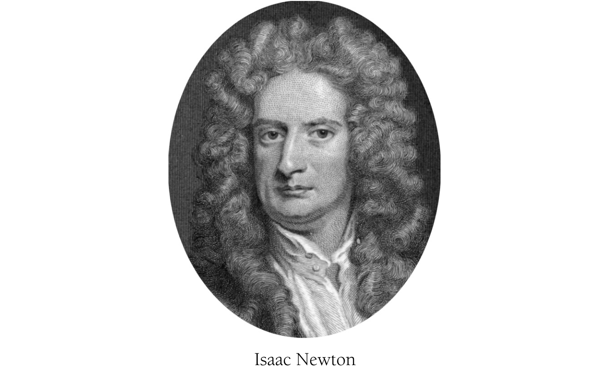

CHAPTER I

Newton

Isaac Newton

Isaac Newton (1642–1727) stands as a seminal figure not just in math- ematics but in all of Western intellectual history. He was born into a world where science had yet to establish a clear supremacy over medieval super- stition. By the time of his death, the Age of Reason was in full bloom. This remarkable transition was due in no small part to his own contributions. For mathematicians, Isaac Newton is revered as the creator of calculus, or, to use his name for it, of "fluxions." Its origin dates to the mid-1660s when he was a young scholar at Trinity College, Cambridge. There he had absorbed the work of such predecessors as René Descartes (1596–1650), John Wallis (1616–1703), and Trinity's own Isaac Barrow (1630–1677), but he soon found himself moving into uncharted territory. During the next few years, a period his biographer Richard Westfall characterized as one of "incandescent activity,” Newton changed forever the mathematical landscape [1]. By 1669, Barrow himself was describing his colleague as

5 llege and very young . . . but of an extraordinary genius and proficiency” [2].

In this chapter, we look at a few of Newton’s early achievements: his generalized binomial expansion for turning certain expressions into infinite series, his technique for finding inverses of such series, and his quadrature rule for determining areas under curves. We conclude with a spectacular consequence of these: the series expansion for the sine of an angle. New- ton’s account of the binomial expansion appears in his *epistola prior*, a let- ter he sent to Leibniz in the summer of 1676 long after he had done the original work. The other discussions come from Newton’s 1669 treatise *De analysi per aequationes numero terminorum infinitas*, usually called simply the *De analysi*.

Although this chapter is restricted to Newton’s early work, we note that “early” Newton tends to surpass the mature work of just about anyone else.

**GENERALIZED BINOMIAL EXPANSION**

By 1665, Isaac Newton had found a simple way to expand—his word was “reduce”—binomial expressions into series. For him, such reductions would be a means of recasting binomials in alternate form as well as an entryway into the method of fluxions. This theorem was the starting point for much of Newton’s mathematical innovation.

As described in the *epistola prior*, the issue at hand was to reduce the binomial $(P + PQ)^{m/n}$ and to do so whether $m/n$ “is integral or (so to speak) fractional, whether positive or negative” [3]. This in itself was a bold idea for a time when exponents were sufficiently unfamiliar that they had first to be explained, as Newton did by stressing that “instead of $\sqrt{a}$, $\sqrt[3]{a}$, $\sqrt[5]{a}$, etc. I write $a^{1/2}$, $a^{1/3}$, $a^{5/3}$, and instead of $1/a$, $1/aa$, $1/a^3$, I write $a^{-1}$, $a^{-2}$, $a^{-3}$” [4]. Apparently readers of the day needed a gentle reminder.

Newton discovered a pattern for expanding not only elementary bino- mials like $(1 + x)^5$ but more sophisticated ones like $\frac{1}{\sqrt[3]{(1 + x)^5}} = (1 + x)^{-5/3}$.

The reduction, as Newton explained to Leibniz, obeyed the rule

$(P + PQ)^{m/n} = P^{m/n} + \frac{m}{n}AQ + \frac{m-n}{2n}BQ + \frac{m-2n}{3n}CQ + \frac{m-3n}{4n}DQ + etc.,$  (1) 